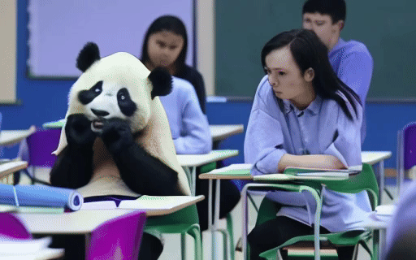

# 🌊 Vico: Compositional Video Generation as Flow Equalization 🌊

<p style="font-family: 'Indie Flower', cursive;" align="center">
All roads lead to Rome!
</p>

This reposioty contains our official implementation for **Vico**. Vico provides a unified solution for compositional video generation by equalizing the information flow of text tokens.

**Compositional Video Generation as Flow Equalization**

🥯[[Project Page](https://adamdad.github.io/vico/)] 📝[[Paper](https://arxiv.org/abs/2404.06091)] </>[[code](https://github.com/Adamdad/vico)]

Xingyi Yang, Xinchao Wang

National University of Singapore


> We introduce Vico, a generic framework for compositional video generation that explicitly ensures all concepts are represented properly. At its core, Vico analyzes how input tokens influence the generated video, and adjusts the model to prevent any single concept from dominating. We apply our method to multiple diffusion-based video models for compositional T2V and video editing. Empirical results demonstrate that our framework significantly enhances the compositional richness and accuracy of the generated videos.

# Results
| Prompt | Baseline | +Vico |
| --- |  --- |  --- | 
| A **crab** **DJing** at a **beach** party during sunset. | | |
| A **falcon** as a **messenger** in a sprawling **medieval city**. | |  |
| A confused **panda** in **calculus class**. | | |

# Installation
- Enviroments
    ```shell
    pip install diffusers==0.26.3
    ```

- For VideoCrafterv2, it is recommanded to download the `diffusers` checkpoints first on (`adamdad/videocrafterv2_diffusers`)[https://huggingface.co/adamdad/videocrafterv2_diffusers]. I do it by convering the official checkpoint to the diffuser format.
    ```shell
    git lfs install
    git clone https://huggingface.co/adamdad/videocrafterv2_diffusers
    ```

# Usage
```shell
export PYTHONPATH="$PWD"
python videocrafterv2_vico.py \
    --prompts XXX \
    --unet_path $PATH_TO_VIDEOCRAFTERV2 \
    --attribution_mode "latent_attention_flow_st_soft" 
```

# 📝 Changelog 
- **[2024.07.09]**: Release arxiv paper and code for Vico on Videocrafterv2.

## Acknowledgement

We are mostly inspired by [Attend&Excite](https://github.com/yuval-alaluf/Attend-and-Excite) for text-to-image generation. 
We thank the valuable disscussion with [@Yuanshi9815](https://github.com/Yuanshi9815).

## Citation

```bibtex
@misc{yang2024vico,
      title={Compositional Video Generation as Flow Equalization, 
      author={Xingyi Yang and Xinchao Wang},
      year={2024},
      eprint={2404.06091},
      archivePrefix={arXiv},
      primaryClass={cs.CV}
}
```
